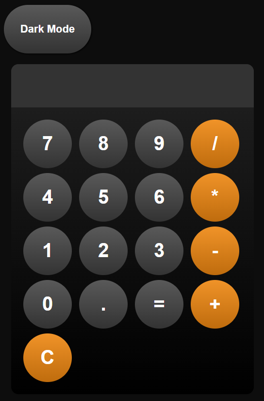

# Simple Calculator App

This is a small practice of **HTML**, **CSS** and **JavaScript**

## Live Demo:

[Calculator App](https://ognjen-simic.github.io/calculator-app/)

## Includes:

- Addition
- Subtraction
- Multiplication
- Division
- **Dark**/**Light** mode toggle

